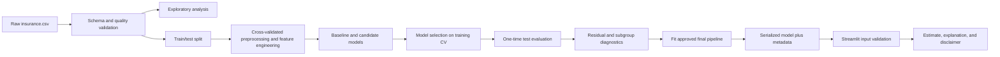

# Insurance Cost Forecasting — Project Specification

**Status:** Planned  
**Version:** 1.0  
**Primary audience:** Project owner, reviewers, and coding agents  
**Last updated:** 3 October 2026

## 1. Project summary

Build an explainable machine-learning system that predicts an individual's annual medical insurance charges from demographic and lifestyle information. The project should demonstrate the complete regression workflow: exploratory analysis, leakage-safe preprocessing, multiple linear regression, interaction effects, residual diagnostics, model evaluation, interpretation, and delivery through a small Streamlit application.

The application must describe its output as **estimated annual medical charges**, not an insurance premium. The source dataset's target is `charges`; it does not contain the price of an insurance policy.

## 2. What I want to happen

When this project is complete:

1. A user can enter age, sex, BMI, number of children, smoking status, and US region in a Streamlit form.
2. The app validates the inputs and returns an estimated annual medical charge in US dollars.
3. The result includes a plain-language explanation of the factors that most influenced that prediction.
4. The app makes uncertainty and limitations visible and never presents the estimate as a quote, diagnosis, or guaranteed future bill.
5. A reviewer can reproduce model training from the raw CSV with one documented command.
6. A reviewer can see how interaction terms, especially `smoker × BMI` and `smoker × age`, affect predictions.
7. Evaluation includes out-of-sample MAE, RMSE, and R², plus residual and subgroup diagnostics.
8. The saved model used by the app is produced by the same tested preprocessing-and-model pipeline used during evaluation.

## 3. Objectives and success criteria

### Product objective

Create an understandable cost-estimation tool backed by a reproducible regression workflow.

### Learning objective

Demonstrate competency in:

- multiple regression;
- interaction effects and nonlinear feature terms;
- residual analysis;
- model interpretation for non-technical readers;
- pandas, scikit-learn, matplotlib/seaborn, and Streamlit;
- reproducible model packaging and testing.

### Model success criteria

- Beat a training-set mean-prediction baseline on the untouched test set for both MAE and RMSE.
- Report test MAE, RMSE, and R²; do not select a model using test-set results.
- Use five-fold cross-validation on the training data for model selection.
- Retain an interpretable linear model as the primary model unless diagnostics clearly show that it is unusable.
- Produce residual plots and document heteroscedasticity, skew, influential errors, and any systematic subgroup errors.
- Report performance by smoking status and sex, and by region when sample sizes are adequate.

### Application success criteria

- A valid form submission produces one estimate without an exception.
- Invalid or missing values produce clear validation messages.
- The app uses the serialized fitted pipeline; it must not duplicate preprocessing logic.
- The output is labelled **Estimated annual medical charges** and formatted in USD.
- The explanation identifies directional drivers without making causal claims.
- The app displays a disclaimer and the model's test-set error context.

## 4. Scope

### Version 1 — required

- Load and validate `insurance.csv`.
- Perform exploratory data analysis.
- Create a dummy mean baseline.
- Build a multiple linear regression baseline.
- Evaluate an enhanced linear model with selected interaction/nonlinear terms.
- Compare raw-target and `log1p(charges)` target strategies.
- Diagnose residuals.
- Interpret coefficients or prediction contributions in plain language.
- Save the final pipeline and metadata.
- Build and test a Streamlit estimator.
- Write a concise model card and README.

### Optional extensions

- Compare the linear model with a regularized model and a tree-based model.
- Add bootstrap or conformal prediction intervals.
- Add a scenario comparison, such as smoker versus non-smoker, while explicitly calling it an association rather than a causal effect.
- Deploy the Streamlit app.

### Out of scope

- Quoting or underwriting a real insurance policy.
- Diagnosing health conditions or recommending treatment.
- Claiming that model coefficients prove causation.
- Collecting or storing user health information.
- Extrapolating to populations, countries, years, or insurance products not represented in the data.
- Using external personal data or protected health information.

## 5. Dataset and data contract

Use the [Medical Cost Personal Dataset on Kaggle](https://www.kaggle.com/datasets/mirichoi0218/insurance). Keep the downloaded CSV out of source control when its license or redistribution terms require that.

Expected columns:

| Column | Type | Role | Validation |
|---|---|---|---|
| `age` | integer | feature | positive adult age; verify observed training range |
| `sex` | category | feature | expected values `female`, `male` |
| `bmi` | float | feature | positive; verify observed training range |
| `children` | integer | feature | zero or greater |
| `smoker` | category | feature | expected values `yes`, `no` |
| `region` | category | feature | `northeast`, `northwest`, `southeast`, `southwest` |
| `charges` | float | target | non-negative annual medical charges |

The data-loading layer must fail clearly if required columns are missing, categories are unexpected, numeric fields cannot be parsed, or duplicate/missing-row handling has not been explicitly decided.

## 6. Functional requirements

### FR-1: Data ingestion

- Read the raw CSV from a configurable local path, defaulting to `data/raw/insurance.csv`.
- Normalize column names and harmless surrounding whitespace.
- Preserve an untouched raw file.
- Produce a validation summary with row count, dtypes, missing values, duplicate rows, numeric ranges, and category levels.

### FR-2: Exploratory analysis

Create reproducible figures for:

- target distribution on raw and log scales;
- charges versus age, BMI, and number of children;
- charges by smoking status, sex, and region;
- BMI versus charges, coloured by smoking status;
- correlations among numeric variables;
- sample counts for categorical groups.

Every chart must have a title, readable labels, units, and a short interpretation. Analysis should distinguish observed association from causation.

### FR-3: Preprocessing

- Split the data before fitting learned preprocessing steps.
- Reserve 20% as a final test set using `random_state=42`; stratify by `smoker` where supported.
- Fit category encoders and any scalers only on training folds.
- One-hot encode nominal categorical variables and handle unknown categories safely.
- Keep preprocessing and prediction in a single scikit-learn `Pipeline`/`TransformedTargetRegressor` structure.
- Do not remove outliers solely because they are expensive cases. Any exclusion must have a documented data-quality reason and before/after comparison.

### FR-4: Feature engineering

Evaluate a small, theory-driven feature set rather than indiscriminate polynomial expansion:

- `age²` to represent nonlinear change with age;
- `smoker × BMI` to test whether BMI has a different association for smokers;
- `smoker × age` to test whether age has a different association for smokers;
- optionally `BMI²` if residual diagnostics support it.

Interaction terms must be generated inside the fitted pipeline or by a deterministic transformer shared by training and inference. Main effects must remain whenever their interaction is included.

### FR-5: Candidate models

Train and compare:

1. mean-prediction baseline;
2. ordinary least-squares model with main effects;
3. enhanced linear model with approved interaction/nonlinear terms;
4. enhanced linear model using `log1p(charges)`, with predictions converted back using `expm1`;
5. optional Ridge regression as a stability check.

If a tree/boosting model is explored, treat it as a secondary benchmark. Do not silently replace the interpretable primary model.

### FR-6: Evaluation

Use cross-validation on the training partition to select the final specification. Then evaluate exactly once on the held-out test set.

Required metrics:

- MAE in USD;
- RMSE in USD;
- R²;
- cross-validation mean and standard deviation;
- subgroup MAE and signed mean error for important categories.

For log-target models, calculate all business-facing metrics after converting predictions back to dollars. Document any retransformation bias and the chosen correction, if used.

### FR-7: Residual diagnostics

Produce and interpret:

- residuals versus fitted values;
- actual versus predicted values with an identity line;
- residual histogram and Q–Q plot;
- residuals versus age and BMI;
- residual distributions by smoking status;
- the largest absolute test errors, identified only by row index and feature values.

Check for nonlinearity, unequal residual variance, skew, systematic over/underprediction, and influential observations. Normal residuals are useful for classical inference but are not a prerequisite for point prediction; explain the distinction.

### FR-8: Interpretation

- Present coefficients with units and reference categories.
- For a log-target model, translate coefficients into approximate percentage differences where appropriate.
- Explain interaction effects using example predictions or marginal-effect plots; never interpret an interaction coefficient in isolation.
- Generate a per-prediction explanation from the linear model's feature contributions when feasible.
- Phrase results as relationships found in this dataset, not causal effects.

### FR-9: Model artifact

Persist:

- the complete fitted pipeline;
- feature/schema version;
- training timestamp;
- source-data fingerprint;
- package versions;
- chosen feature specification;
- test metrics and expected input categories.

The app must reject an artifact with an incompatible schema/version.

### FR-10: Streamlit app

The app should contain:

- a short explanation of what is being estimated;
- form controls with sensible validation and units;
- a Predict button;
- the estimate in USD;
- an optional honest uncertainty range if a validated interval method is implemented;
- a short list or chart of the strongest model drivers for the entered profile;
- a model-performance summary;
- a limitations and disclaimer section.

The app should not write submitted values to disk, logs, analytics, or a remote service.

## 7. Pipeline design



### Training flow

1. Validate the raw schema and create the data-quality report.
2. Split features and target, then create the held-out test set.
3. Define preprocessing with numeric and categorical branches.
4. Add deterministic interaction/nonlinear features.
5. cross-validate candidate pipelines on training data.
6. Select a model using predefined metrics, interpretability, and diagnostics.
7. Evaluate the selected model once on the test set.
8. Run residual and subgroup analyses.
9. Refit the approved pipeline using the intended training data policy.
10. Serialize the pipeline and metadata together.

### Inference flow

1. Accept one form submission.
2. Validate types, allowed categories, and supported ranges.
3. Convert the values into a one-row DataFrame with the training schema.
4. Call `pipeline.predict()` once.
5. Convert the output to dollars if target transformation is part of the pipeline.
6. Calculate explanation values from the same transformed row.
7. Render estimate, context, limitations, and model version.

## 8. Proposed repository structure

```text
insurance-cost-forecasting/
├── CLAUDE.md
├── RULE.md
├── PROJECT_SPEC.md
├── README.md
├── pyproject.toml
├── .gitignore
├── data/
│   ├── raw/                 # insurance.csv; normally not committed
│   └── processed/           # generated; not committed
├── models/                  # generated artifacts; policy documented
├── reports/
│   ├── figures/
│   └── model_card.md
├── notebooks/
│   └── 01_eda.ipynb
├── src/insurance_cost/
│   ├── __init__.py
│   ├── config.py
│   ├── data.py
│   ├── features.py
│   ├── train.py
│   ├── evaluate.py
│   ├── explain.py
│   └── artifacts.py
├── app/
│   └── streamlit_app.py
└── tests/
    ├── test_data.py
    ├── test_features.py
    ├── test_training.py
    └── test_app_smoke.py
```

Notebooks are for exploration and communication. Reusable training, transformation, evaluation, and inference logic belongs in `src/`.

## 9. User experience

Suggested controls:

- **Age:** integer input constrained to the supported training range.
- **BMI:** decimal input with a note explaining the unit (kg/m²).
- **Children:** non-negative integer input.
- **Smoking status:** Yes/No selection.
- **Sex:** category selection matching the dataset.
- **Region:** selection matching the four dataset categories.

Suggested result language:

> Estimated annual medical charges: **$X,XXX**
>
> On the held-out test data, predictions were typically off by about **$MAE**. This estimate reflects patterns in a small historical dataset and is not an insurance quote or medical advice.

The explanation should say, for example, that smoking status and its interaction with BMI increased or decreased the model estimate relative to its learned reference profile. It must not say that a feature definitively caused a person's costs.

## 10. Quality, testing, and reproducibility

Required automated checks:

- schema validation catches missing/renamed columns and invalid categories;
- feature generation is deterministic and preserves column order;
- training with the same seed gives reproducible metrics within tolerance;
- preprocessing does not learn from test data;
- serialized and in-memory pipelines return equivalent predictions;
- log-target predictions are returned on the dollar scale and are non-negative;
- app input mapping matches the training schema;
- one valid low/middle/high-cost example completes end to end;
- linting and tests pass from a clean environment.

Store dependency versions in `pyproject.toml` and record the random seed. Generated charts, artifacts, and processed data must be reproducible rather than hand-edited.

## 11. Responsible-use requirements

- State that the dataset is small and may not represent current or broader populations.
- Avoid causal claims about sex, region, smoking, BMI, or costs.
- Report material error gaps across evaluated subgroups.
- Discuss whether including `sex` improves performance enough to justify its use; compare a model without it.
- Do not treat region as a proxy for an individual's risk beyond this dataset.
- Do not collect or persist app inputs.
- Avoid advice that could affect insurance eligibility, coverage, or medical decisions.

## 12. Delivery milestones

### Milestone 1: Foundation

- Repository scaffold, environment, data instructions, schema validator, and tests.

### Milestone 2: Analysis

- EDA notebook/report with clear figures and written findings.

### Milestone 3: Modelling

- Baseline and enhanced pipelines, cross-validation comparison, test evaluation, and residual diagnostics.

### Milestone 4: Interpretation

- Coefficient/interaction explanation, subgroup analysis, and model card.

### Milestone 5: Product

- Streamlit app, smoke tests, screenshots, and run/deployment instructions.

## 13. Definition of done

The project is done when:

- all Version 1 requirements are implemented;
- data setup and all commands are documented;
- a fresh environment can run tests and reproduce training;
- the final artifact is created only by the documented training pipeline;
- the app loads the artifact and completes a prediction;
- metrics, residual plots, subgroup checks, and limitations are published;
- no notebook-only code is required by the app;
- `RULE.md` and `CLAUDE.md` are current;
- all tests and quality checks pass.

## 14. Source references

- [Medical Cost Personal Dataset — Kaggle](https://www.kaggle.com/datasets/mirichoi0218/insurance)
- [Predicting Insurance Costs guided project — Dataquest](https://www.dataquest.io/projects/guided-project-a-predicting-insurance-costs/)

