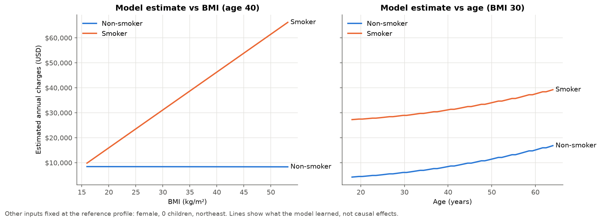

# Insurance Cost Forecasting

An explainable multiple-regression project that estimates **annual medical charges** from age, sex,
BMI, number of children, smoking status and US region, delivered as a Streamlit estimator.
It is a learning/portfolio demonstrator: **not an insurance quote and not medical advice.**

- Requirements: [`PROJECT_SPEC.md`](PROJECT_SPEC.md) · Rules: [`RULE.md`](RULE.md)
- Model details, diagnostics, fairness and limitations: [`reports/model_card.md`](reports/model_card.md)
- Exploratory analysis: [`notebooks/01_eda.ipynb`](notebooks/01_eda.ipynb)

## Results

Linear regression with smoker interactions, selected by 5-fold cross-validation on the training
split. The test set is 268 held-out rows (20%, stratified by smoker, `random_state=42`).
Model `1.0.0+ols_enhanced_obesity`, all figures in USD per year:

| Test set | MAE | RMSE | R² |
|---|---|---|---|
| **Model** | **$2,227** | **$4,109** | **0.886** |
| Predict-the-mean baseline | $9,240 | $12,147 | 0.000 |

The main finding is an interaction. **For non-smokers, BMI is associated with almost no difference
in charges; for smokers, crossing BMI 30 is associated with about $15k more per year.** An
additive model can't represent that, and adding the interaction terms cut cross-validated MAE from
$4,257 to $2,405.



Errors are not evenly spread. 91% of test rows are within $2k, but a group of mostly non-smokers
with unexplained high costs is under-predicted by up to about $20k. See the model card for residual and
subgroup diagnostics.

## Setup

Requires Python 3.11+ (developed on 3.14).

```bash
python -m venv .venv
source .venv/bin/activate
python -m pip install -e ".[dev]"
```

> **macOS + Python 3.13/3.14 note:** if `import insurance_cost` fails after the editable install,
> the `.pth` file may have the macOS `hidden` flag, which recent Python versions skip. Fix with
> `chflags -R nohidden .venv`.

## Data

The [Medical Cost Personal Dataset](https://www.kaggle.com/datasets/mirichoi0218/insurance)
(1,338 rows) is not committed. Download `insurance.csv` from Kaggle and place it at:

```text
data/raw/insurance.csv
```

The raw file is never modified. Loading validates columns, types, missing values, ranges and
categories. The dataset contains one exact duplicate row; with no ID column it cannot be shown to be
an error, so it is kept and reported (`DEFAULT_DUPLICATE_POLICY = "keep"` in `insurance_cost.data`).

## Train

```bash
python -m insurance_cost.train --data data/raw/insurance.csv
```

This validates the data, splits it, cross-validates all candidate models, applies the predefined
selection rule, evaluates once on the test set, and writes:

- `models/insurance_cost_model.joblib`: fitted pipeline + metadata (gitignored; reproduce with the command)
- `reports/metrics.json`: CV table, test metrics, subgroups, diagnostics, coefficients
- `reports/figures/`: CV comparison, residual diagnostics, interaction and subgroup plots

## Run the app

```bash
streamlit run app/streamlit_app.py
```

Enter the six details and select **Estimate charges**. The app shows the estimated annual medical
charges, the typical test error, a chart of what moved the estimate relative to a reference
person, a smoker/non-smoker comparison (labelled as an association), model performance, and limitations.

The app loads the trained artifact and refuses one with an incompatible schema. It contains no
preprocessing of its own. Submitted values are not stored, logged or transmitted, and Streamlit
usage statistics are disabled in `.streamlit/config.toml`. Set `INSURANCE_COST_ARTIFACT` to load
an artifact from another path.

## Project layout

```text
src/insurance_cost/
  config.py      paths, seed, schema version, category levels
  data.py        loading and validation
  features.py    deterministic feature engineering + preprocessing pipeline
  models.py      ChargesRegressor and candidate model specifications
  train.py       CV comparison, selection, test evaluation, CLI
  evaluate.py    metrics, subgroup/residual diagnostics, figures
  explain.py     coefficient table and per-prediction explanations
  artifacts.py   save/load pipeline + metadata with schema checks
  inference.py   app input validation and mapping to the training schema
app/streamlit_app.py
notebooks/01_eda.ipynb
reports/{model_card.md, metrics.json, figures/}
tests/
```

## Checks

```bash
pytest          # unit tests use synthetic fixtures; one integration test uses the real CSV if present
ruff check .
ruff format --check .
```
